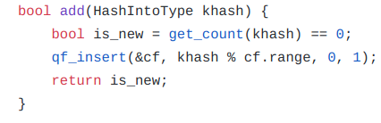

## Abstract

I tested Counting Quotient Filter implemented in Khmer. The concept looks promising because of the new functionality offered by cqf: data locality, merging, and resizing. However, the implementation needs more work to be of similar quality of Khmer count min sketch. I will only include in this assessment about the downsides since the authors bragged about the upsides more than enough. 
Summary of the Downsides:
1. When inserted kmer to fully loaded sketch the code just fail. I can’t even catch an exception.
2. Sketch size can only be of power of two. If you want to increase the sketch size you need to double it.
3. Sketch uses variable length counter for each kmer with max 2 bytes. If the kmer count exceeds 65535. The counter overflow and the value resets([See Basic Test](Basic Test))
4. Resizing is not implemented in the cqf library, and It can’t be implemented using the current cqf library.(See resizing issue)
5. CQF produces larger counting errors, but less often than countmin sketch(See accuracy test).
6. I also tested loading the cqf with load factors more than 95%, and It passed the test. All the paper calculations are made where the cqf is loaded at 95%, so I was trying to make sure it can be fully loaded without failing(See Load Factor test).

## Basic Test
[Code](https://github.com/shokrof/khmer/blob/DibMaster/tests/test_CQF.py)

I used some testcases from khmer to test the new QFCounttable. The test cases cover simple count, save, loading, and counting big values. All the test cases passed except counting the big values. CQF dynamically allocate bigger counters for high frequent items.However, the largest counter is 2 bytes; therefore, It can count up to 65535. If we try to count more than 65535, the counter overflows and counting stars from the beginning.

## Resizing Issue

CQF hashes a kmer and divides the hash bits into two components: quotient and reminder. Quotient part is used to determine a certain slot. Then, CQF put the reminder in this slot.  In Khmer, Mod is applied on the mumur hash bits and filter range(cf.range= 2^(q+r)).

From [Storage.hh](https://github.com/shokrof/khmer/blob/DibMaster/include/oxli/storage.hh): 438

To make the filter bigger but using the same hash function we need to increase the q value and decrease the r value to maintain the cf.range the same
If we need to increase the number of slots for resizing, we need to increase the q without decreasing cf.range. Changing cf.range is similar to changing the hash function. So, We can increase the q and decrease r and maintain cf.range constant before and after the resizing.

I found that the r is always set to 8(size +8 ). I tried to change it to 5, but the code fails the basic test. Therefore. I concluded we can't implement resizing technique described in cqf paper using this cqf implementation. Unless this bug is fixed.
From [Storage.hh](https://github.com/shokrof/khmer/blob/DibMaster/include/oxli/storage.hh): 

##Accuracy Test
[Script](https://github.com/shokrof/khmer/blob/DibMaster/testsCQF/runTests.sh)

I am trying to compare the accuracy of khmer implementation of both cqf and count min sketch. 
1. I created a dataset of kmers
2. Load the sketch using the dataset
3. Calculate the accuracy of kmers exist in the sketch.
4. Calculate the accuracy of kmers don’t exist in the sketch.

###Dataset
I created a simulated dataset for testing CQF implementation in Khmer. I developed [script](https://github.com/shokrof/khmer/blob/DibMaster/testsCQF/generateSeq.py) to generate kmers with left skewed frequency([zipifan distribution](https://en.wikipedia.org/wiki/Zipf%27s_law)). 
The script generates 3 files: 
1. dataset: kmers to be counted.
2. TruekmerCount:kmers count in format “kmer\tcount”.
3. Unseen Kmers: kmers that don't exist in the previous dataset.

I generated 1M kmer of length 20 and 10K unseen kmers.Here is the frequency distribution for the 1M kmers

###Experiment:
I did the experiment  using different sketch sizes. Sketch size is approximate number for the actual size allocated in the memory.

I used simple accuracy measure. I calculate the absolute difference between the true count for the kmer and the observed count ([Accuracy Test Code](https://github.com/shokrof/khmer/blob/DibMaster/testsCQF/testPerfomance.py)). I drew boxplot for all the values ([Plotting Code](https://github.com/shokrof/khmer/blob/DibMaster/testsCQF/plotPerformanceBoxPlot.py)).

As Expected, The cqf has less errors than count min sketch, but the cqf errors are more scattered. 

##Load Factor Test
[RSQF Code](https://github.com/shokrof/khmer/blob/DibMaster/testsCQF/testLoadFactor.py),[CQF Code](https://github.com/shokrof/khmer/blob/DibMaster/testsCQF/testLoadFactorCQF.py)

In Table2 from [cqf paper](https://www3.cs.stonybrook.edu/~ppandey/files/p775-pandey.pdf),  Bit per element is inversely proportional to the load factor of the RSQF. For load factor 95%, RSQF is more space efficient than bloom filter for all fpr values less than 1/64. Here, I am testing loading capacity of cqf . 
The first obstacle is to calculate the load factor for the cqf. After reviewing cqf code, I found that the number of slots that are actually allocated is more than the number passed as input. First, cqf code adds 10*sqrt(nslots) to the number of slots. Second, the result is rounded up to the next number divisible by 64. 

I created QFCounttable by passing 8192 as input. 9152 slots are created. I gradually increase the load factor by inserting more unique kmers. The program succeeded to insert 9050 unique kmers(98% load factor). The number of hash collisions was 24.Code

In this case, RSQF can be more space efficient than the bloom filter. However, The counting feature must be disabled first. The cqf paper claims that the counting does not take extra space which is not correct. 

I am trying to test the loading of cqf with uniformly distributed kmers. I repeated the above experiment but each kmer is repeated M times. I ran the experiments  with different values of M and recorded the maximum number of kmers that can be inserted.
Values of M are 2**i-1 for i in 1:16

I was expecting the graph to be in the shape of a ladder. The Number of unique kmers will be constant for all Ms except 3 and 255 where it will have steep changes. The steep changes indicates that the cqf decides using bigger counters. However, I observed that the number of unique kmers that can be inserted keeps decreasing with the increase of M. I don’t know the reason.
